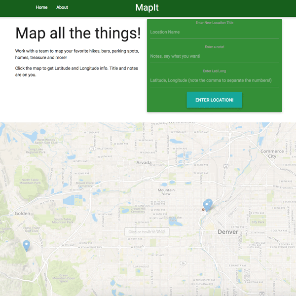

# p2-webapp-client - MapIt 1.0 (alpha)

Link to deployed app:[HERE](https://p2-web-app.firebaseapp.com/)
---
## Front End

### Tech Used:
  - [Materialize CDN](https://cdnjs.cloudflare.com/ajax/libs/materialize/0.97.5/js/materialize.min.js)
  - [Mapbox / Leaflet](http://leafletjs.com/)
  - [End to end tests with Cypress](https://www.cypress.io/)
  - [Deployed via Google Firebase](https://firebase.google.com/)
  - [Express / Node server](https://github.com/expressjs/express/)
  - [ES6 javascript](http://es6-features.org/#Constants) (for the mostpart)
  - reset.css: [Meyers Reset](https://meyerweb.com/eric/tools/css/reset/)

Check it out!

### To Come: 
  - database support: saved maps, e.g. bars, hikes, routes. 
  - private/user-only maps: share and maintain a map for your team.
  - map skins - e.g. choose topography, street, satalite, 3d mode... 
  - ui/ux - roll the location submission form directly into the map for a more intuitive

  - Potentially a useful progressive application?